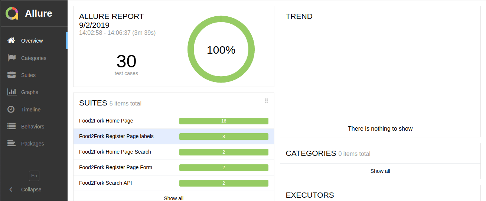

# webdriverio-tests

The project contains examples to create page objects and tests using [webdriverio 5.x](https://www.npmjs.com/package/webdriverio) and [ES6](http://es6-features.org/#Constants). The test runner is the [@wdio/mocha-framework](https://www.npmjs.com/package/@wdio/mocha-framework). 
```
npm run test
```
The project also contains units tests with [mocha](https://www.npmjs.com/package/mocha) and [chai](https://www.npmjs.com/package/chai) for [src/index.js](https://github.com/mir-nawaz/webdriverio-tests/blob/master/src/index.js), present at [test/unit](https://github.com/mir-nawaz/webdriverio-tests/blob/master/test/unit/index.spec.js). 
```
npm run test:unit
```
This project was created to serve as a reference to others interested in ES6 webdriver.io tests.

# Dependencies
* Node.js - The latest [LTS release](https://nodejs.org/en/)
* Java -- Needed to run the selenium server
* Chrome.
* Ubuntu 18.04 

# Test execution
1) Clone the latest version of this repo.
2) ```npm install```
3) ```npm run test```
4) ```npm run test:unit```
5) ```npm run test:register```
6) ```npm run test:search```
7) ```npm run test:search.api```

# ALLURE REPORTER
## Report 
```npm run report```


# Run standalone spec
To execute a standalone spec run  ``` ./node_modules/.bin/wdio --spec <path to test> ./wdio.conf.js```

Example:
```./node_modules/.bin/wdio --spec ./test/specs/register.js ./wdio.conf.js```
